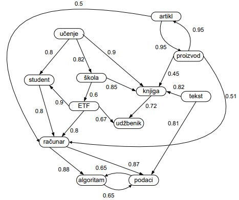
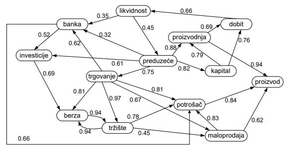

## Taskovi
- [ ] Obraditi edge cases.
- [X] Dodati izbacivanje grane.
- [X] Dodati izbacivanje cvora.
- [ ] Napraviti prioritetni red.
- [ ] Napraviti dijkstra algoritam :skull: .

## Izgled grafa iz graf1.txt

## Izgled grafa iz graf2.txt
